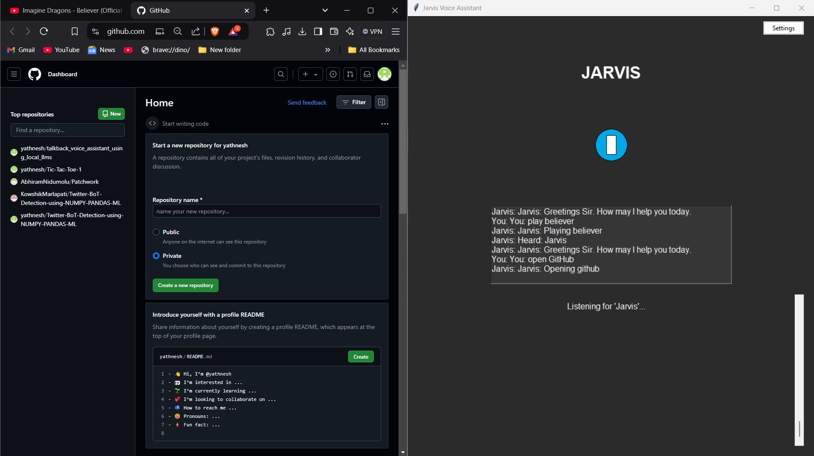
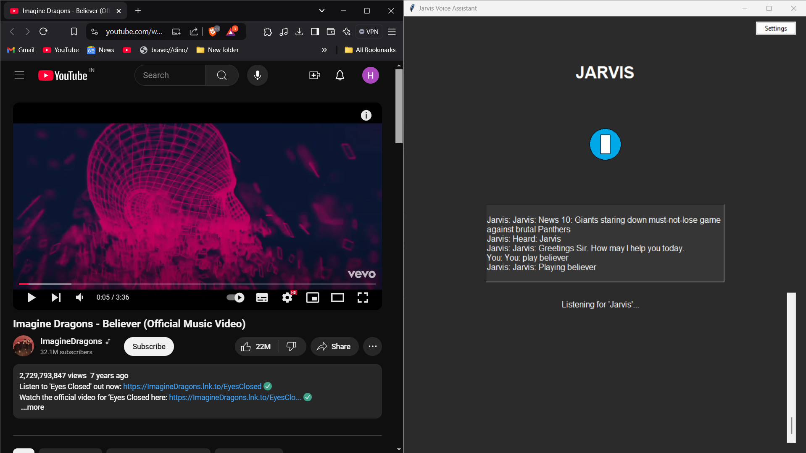
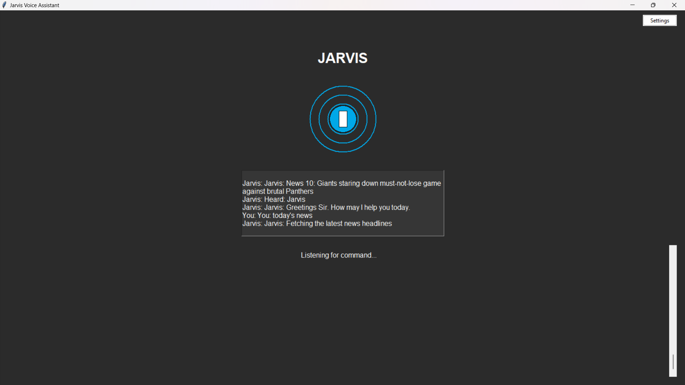
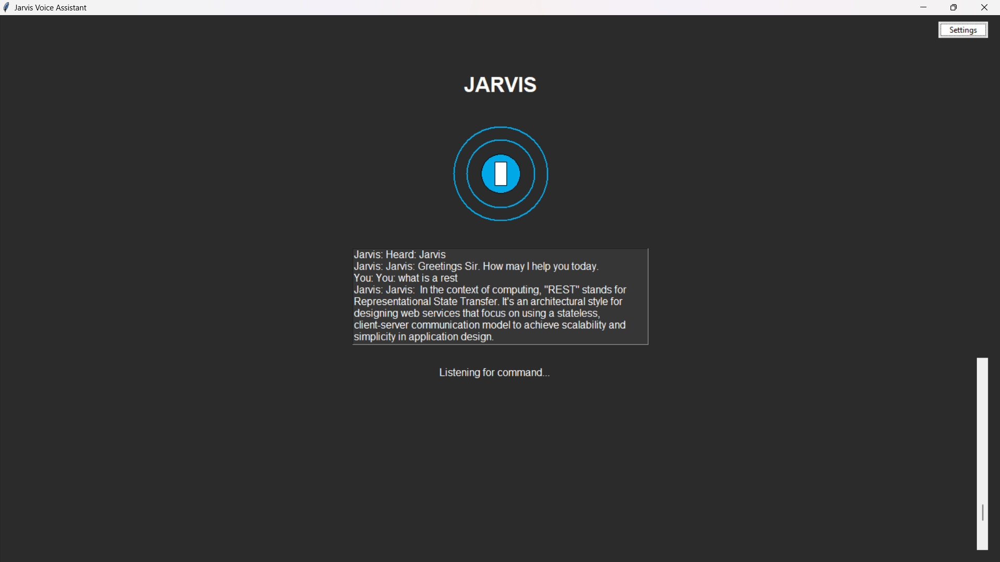

# Jarvis Voice Assistant

A modern voice-controlled assistant with a graphical user interface that can perform various tasks including website navigation, music playback, news fetching, and conversational AI responses using the Mistral language model.

## Features

- **Voice Control**: Activate with the wake word "Jarvis" and issue voice commands
- **Modern GUI**: Clean, dark-themed interface with animated microphone visualization
- **Website Navigation**: Quick access to popular websites through voice commands
  
- **Music Playback**: Voice-controlled YouTube music playback with customizable library
  
- **News Updates**: Fetch and read out latest news (general or topic-specific)
  
- **AI Conversations**: Integrated with Mistral AI model for natural language interactions
  
- **Settings Management**: GUI-based settings manager for customizing websites and music library
  
- **Real-time Feedback**: Visual and audio feedback for all interactions

## Download

The executable file (229 MB) is available for download from Google Drive:

[Download Voice Assistant](https://drive.google.com/file/d/1X9l3-4UfxUrQ3udruPmPIHFJqY6ZW6ts/view?usp=sharing)

If you prefer a non-GUI version of the voice assistant then use the below link:

[Download Voice Assistant](https://drive.google.com/file/d/1T_RmPJ1DrQ_SGf18yZ9m-Ar8T5bUpCX0/view?usp=sharing)

## Prerequisites

Before running this application, you need to install:

1. Ollama: Install from [Ollama's official website](https://ollama.ai/).
2. Mistral model for Ollama: After installing Ollama, run:
   ```
   ollama pull mistral
   ```

## System Requirements

- Windows operating system
- A working microphone
- Active internet connection
- At least 1 GB of free disk space

## Installation

1. Click the download link above to download the executable file.
2. Once downloaded, no further installation is needed. The .exe file is self-contained.

## Usage

1. Ensure Ollama is running on your system.
2. Double-click the .exe file to run the voice assistant.
3. Wait for initialization (may take a moment due to the large file size).
4. The assistant will start listening for the wake word "Jarvis".
5. Once activated, give voice commands or ask questions.

## Troubleshooting

- If you encounter a Windows SmartScreen warning, click "More info" and then "Run anyway".
- Ensure your antivirus software is not blocking the application.
- If the application is slow to start, please be patient as it may take time to load all components.

For any other issues, please open an issue in this GitHub repository.

## Source Code

The source code for this project is available in this GitHub repository. You can clone it and build the application yourself if you prefer.

## Building from Source

If you want to build the application yourself:

1. Clone this repository
2. Install the required Python libraries:
   ```
   pip install -r requirements.txt
   ```
3. Use PyInstaller to create the executable:
   ```
   pyinstaller --onefile jarvis.py
   ```

## License

This project is licensed under the MIT License. This means:

- You are free to use, copy, modify, merge, publish, distribute, sublicense, and/or sell copies of the software.
- The software is provided "as is", without warranty of any kind, express or implied.
- The authors or copyright holders are not liable for any claim, damages or other liability arising from the use of the software.

For the full license text, please see the LICENSE file in the repository.

### Third-Party Licenses

This project uses several third-party libraries and tools, each with its own license:

- Ollama: [Apache License 2.0](https://github.com/ollama/ollama/blob/main/LICENSE)
- Mistral AI model: [Apache License 2.0](https://github.com/mistralai/mistral-src/blob/main/LICENSE)
- PyInstaller: [GPL with a special exception which allows to use PyInstaller to build and distribute non-free programs](https://github.com/pyinstaller/pyinstaller/blob/develop/COPYING.txt)

Please refer to the respective licenses of these projects for more details.

Note: When distributing this software, ensure you comply with the licenses of all included third-party components.
